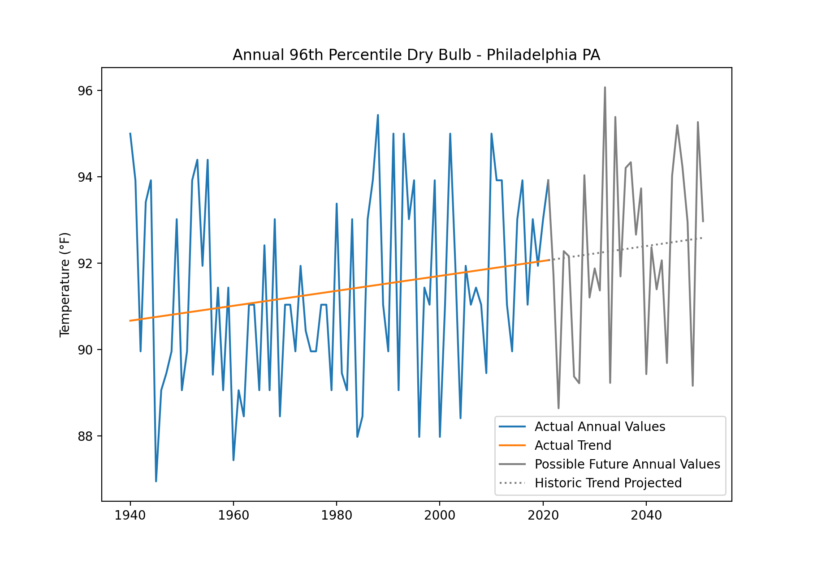

# design-day

Proposal for future climatic design conditions based on climate modeling outputs

Source for data is [NOAA's Global Historical Climatology Network (GHCN) Daily dataset](https://www.ncei.noaa.gov/products/land-based-station/global-historical-climatology-network-daily)

Possible future values shown were calculated with a random number generator using a normal distribution with a standard deviation equal to the actual data (1940-2021) added to the actual historic trend values.